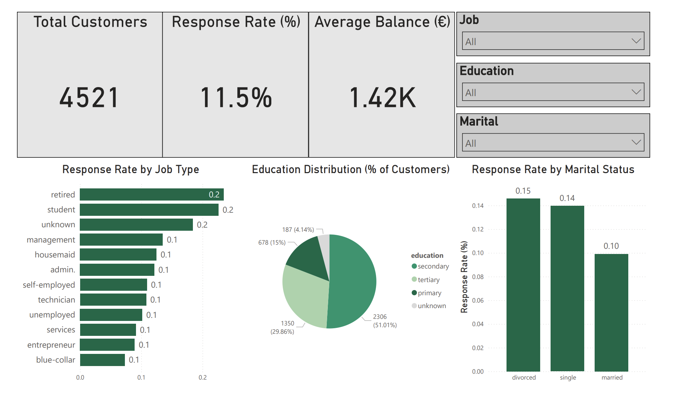

# Bank Marketing Analytics Dashboard
This project analyzes data from a bank marketing campaign to understand which customer groups are most likely to subscribe to a term deposit

---

### Overview
This project explores customer response behavior in a bank marketing campaign to uncover which segments are most likely to subscribe to a term deposit.  
It combines **Python-based data analysis** and an **interactive Power BI dashboard** to deliver insights that support data-driven marketing strategies.

---

### Objectives
- Analyze and interpret key patterns in customer behavior.  
- Identify which **job, education, and marital segments** respond best to marketing efforts.  
- Build an **interactive Power BI dashboard** summarizing campaign KPIs and trends.  
- Present actionable insights to guide business decisions.

---

### Tools & Technologies
| Area | Tools Used |
|------|-------------|
| Data Analysis | Python, Pandas, Matplotlib |
| Visualization | Power BI Desktop |
| Documentation | Markdown, PDF Report |
| Version Control | Git, GitHub |

---

### Project Structure
bank-marketing-analytics/
|-- data/ # CSV datasets (bank_data.csv, job_summary.csv, edu_summary.csv)
|-- notebooks/ # Jupyter notebook for data cleaning & EDA
|-- powerbi/ # Power BI dashboard (.pbix file)
|-- reports/ # PDF report 
\-- requirements.txt # Python dependencies

---

### Key Insights
- **Retired** and **student** customers have the highest subscription rates (> 22%).  
- Clients with **tertiary education** respond better (+4 p.p. vs. primary education).  
- **Single** customers are more open to offers (≈ 14% response rate).  
- The **average balance** of subscribers is **12% higher** than non-subscribers.  
- Overall campaign **response rate:** 11.5%.  

---

### Power BI Dashboard Preview
```markdown

